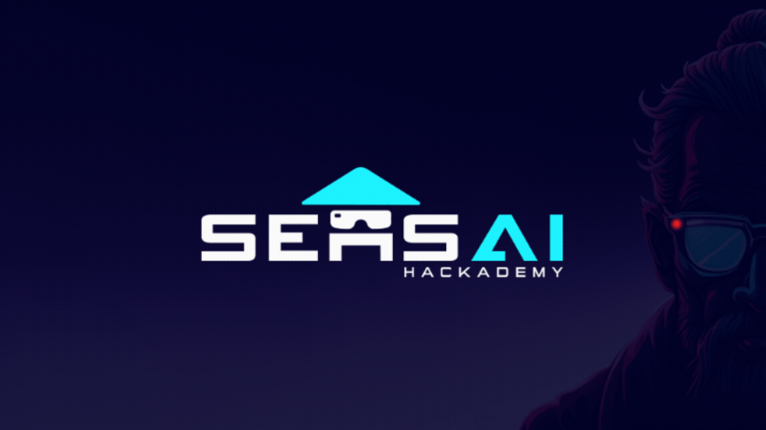

# SensAI Kits

This is a collection of context-aware AI kits, fully integrated with the Meta XR SDK and Unity.  
Vision kits are built to support Meta Camera Access (PCA).
  

  

## Table of Contents

1. [Zero-Shot Object Detection Kit](#1-zero-shot-object-detection-kit)  
2. [Custom AI Model Training Kit (Roboflow)](#2-custom-ai-model-training-kit-roboflow)
3. [Poker AI Assistant (Roboflow)](#3-custom-ai-model-training-kit-roboflow)   
4. [Text-to-Speech Sample](#4-text-to-speech-sample)  
5. [License](#5-license)  

## Overview

## 1. 🎯 Zero-Shot Object Detection Kit

A Unity plugin that enables real-world object detection in XR using Microsoft Florence-2 on Meta Quest.
 
- Instantly detect objects in your environment with zero-shot AI (no training required)  
- Send image data from your Quest to the Florence API and receive rich detection \& description results  
- Fully integrated with Unity for easy setup and flexible use in XR workflows  

### ⚠️ Limitations

- **Not Real-Time:** API response times mean detection is fast but not instantaneous  
- **Requires Internet:** Wi-Fi needed to send images to the cloud API
- **No Timestamps:** Bounding boxes are not time-synced  

#### GitHub: 👉 [Zero-Shot Object Detection Kit](https://github.com/lucas-martinic/Unity-MetaXR-AI-Florence2)  
 

## 2. 🤖 Custom AI Model Training Kit (Roboflow)

A Unity plugin that brings you custom-trained object detection to XR — powered by Roboflow and optimized for Meta Quest.
 
- Upload and annotate your own image datasets (capturing directly on Meta Quest recommended)  
- Run models locally on-device for faster inference and offline use  
- Fully integrate detection results into your Unity XR app  

### ⚠️ Limitations

- **Setup Time:** Requires effort to collect, annotate, and train datasets  
- **CUDA & Docker Setup Needed:** See [Roboflow’s repo](https://github.com/roboflow/inference)  

#### GitHub: 👉 [Custom AI Model Training Kit](http://github.com/nigelhartm/MetaPCARoboflow)  
 

## 3. ♣️ Poker AI Assistant (Roboflow)

A Meta Quest application that uses computer vision and Poker Odds API to calculate poker hand strenght in real time. 
 
- Detects poker cards and calculates odds and win probabilities
- Runs 100,000+ simulations for highly accurate predictions using the Poker Odds API
- Performs local inference directly on Meta Quest
- Minimalistic UI/UX optimized for wearables 

### ⚠️ Setup Notes

- **Wi-Fi Configuration:** Ensure Meta Quest is on the same Wi-Fi as your server
- **Server Setup:** Local Roboflow inference server and Node.js Poker Odds server must be running
- **Permissions & IP:** Verify permissions on Meta Quest and correct IP address in RoboflowCaller  
- **CUDA & Docker Setup Needed:** See [Roboflow’s repo](https://github.com/roboflow/inference)  

#### GitHub: 👉 [Poker AI Assistant](https://github.com/nigelhartm/PokerAssistant)  
 

## 4. 🔊 Text-to-Speech Sample
### OpenAI TTS API

- High-quality, natural English voices with low latency  
- Easy API integration and fast setup  
- Free tier includes ~3,000 sentences/month  

#### GitHub: 👉 [XR AI Text to Speech](https://github.com/rikturnbull/xr-ai-text-to-speech)  
 

## 5. 📜 License
By downloading and using these kits, you agree to the [License Terms](./LICENSE).

 

